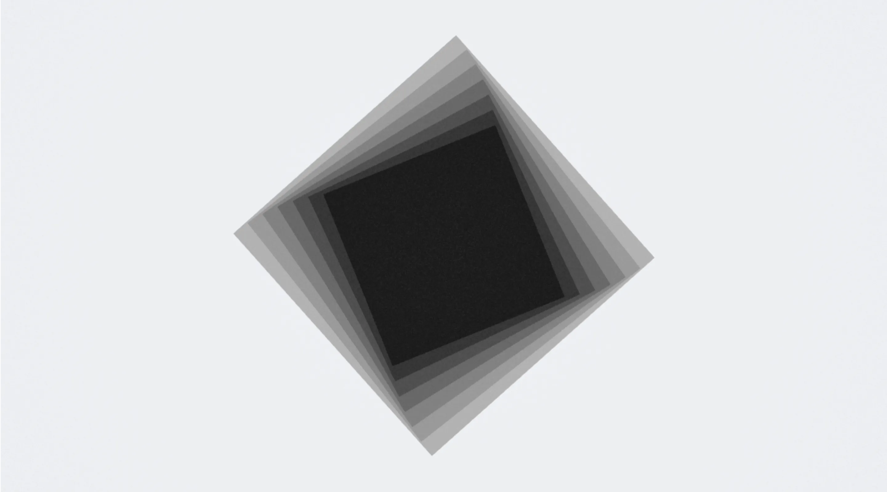
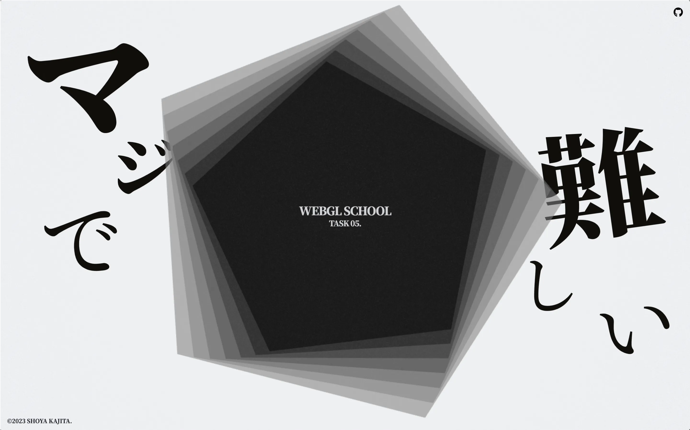
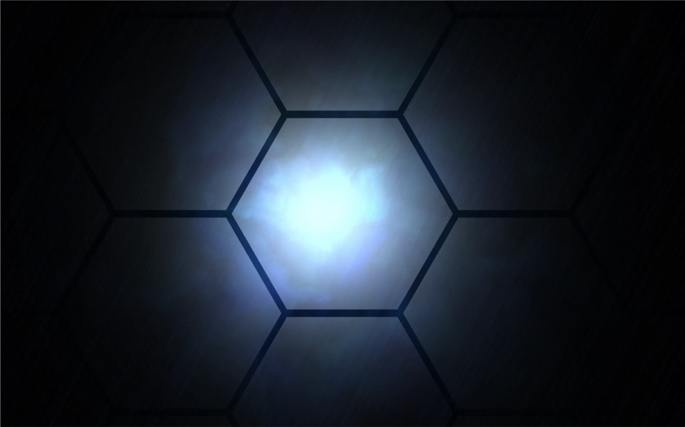
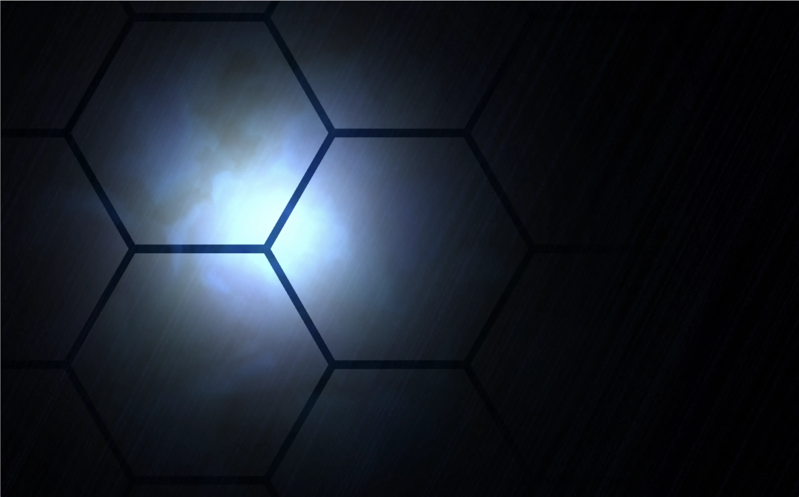
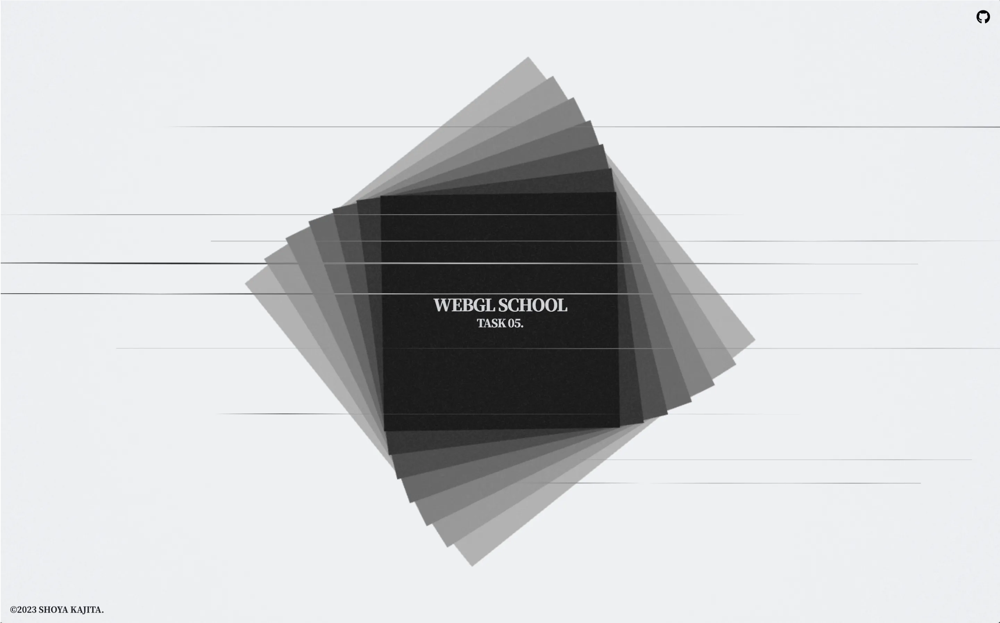

# Task.05 ~ WebGL スクール第 10 期

## 🪬 ~ 要件

- 五角形を作るという課題に挑戦することから始めてみましょう。
- もし五角形がうまく作れたら、次は五芒星（星型）を描いてみるというように、少しずつ、複雑な形に挑戦してみましょう。

※ 生 WebGL で実装すること

## 🧸 ~ Inspiration

- https://www.pinterest.jp/pin/1046946244607714305/

## 👾 ~ Demo

- https://dev.shoya-kajita.com/021/



## 📸 ~ Other Photo









## 🎮 ~ Getting Started

- node : v.17.0.0
- npm : 8.1.0

```
// install
npm i

// development
npm run dev

// production
npm run build

// build preview
npm run preview
```
